# Smart-Traffic-Light-Controller-Verilog
A Verilog HDL implementation of a Smart 4-Way Traffic Light Controller using FSM with adaptive timing, pedestrian crossing, emergency vehicle priority, and full Vivado simulation &amp; synthesis reports.

## Overview

This project implements a **Smart 4-Way Traffic Light Controller** using **Verilog HDL**.
The design controls traffic signals for **North, East, South, and West roads** using **Finite State Machine (FSM)** logic with support for **Pedestrian Crossing, Emergency Vehicle Priority, System Fault Detection, and Adaptive Timing based on Time of Day**.

The design is simulated and synthesized using **Xilinx Vivado**.

---

# Architecture

The Smart Traffic Controller consists of:

1. Traffic Signal FSM Controller
2. Adaptive Timing Unit
3. Priority Handling Unit
4. Pedestrian Crossing Control
5. Emergency Vehicle Priority Logic
6. System Fault Safe State Logic

The controller manages traffic flow dynamically and ensures safe transitions between signals based on real-time conditions.

---

# Block Diagram

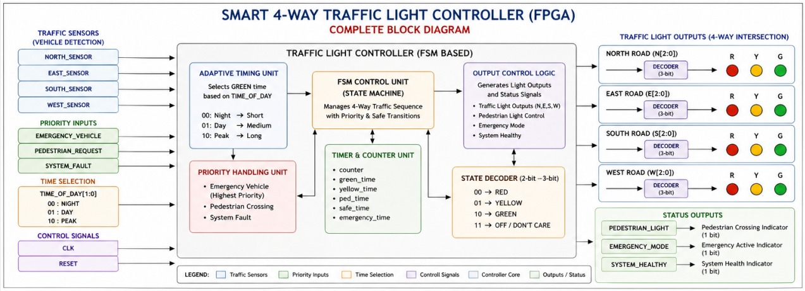

---

# Circuit Diagram

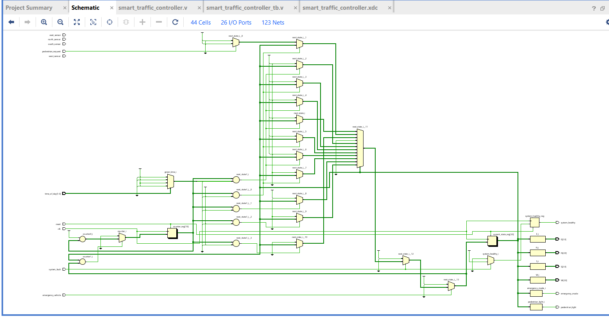

---

# FSM Design

The controller operates using multiple FSM states:

```text
S0 → S1 → S2 → S3 → S4 → S5 → S6 → S7 → S0
```

Additional Priority States:

```text
S8 → Pedestrian Crossing
S9 → Safe State (All RED)
S10 → Emergency Mode
```

### Main States

* S0 : North Green
* S1 : North Yellow
* S2 : East Green
* S3 : East Yellow
* S4 : South Green
* S5 : South Yellow
* S6 : West Green
* S7 : West Yellow
* S8 : Pedestrian Crossing
* S9 : Safe State
* S10 : Emergency Mode

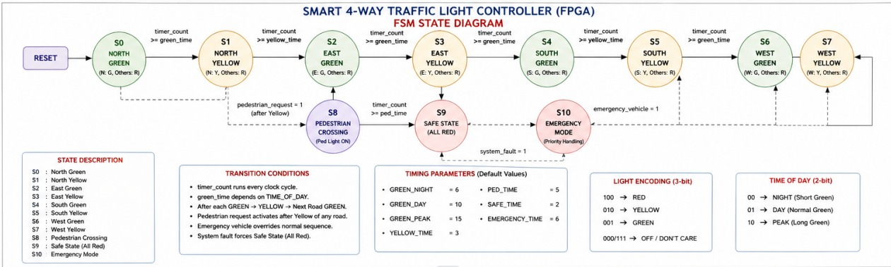

---

# RTL Module

### Smart Traffic Controller

Controls 4-way traffic signals with pedestrian and emergency handling.

```text
smart_traffic_controller.v
```

### Inputs

* clk
* reset
* north_sensor
* east_sensor
* south_sensor
* west_sensor
* emergency_vehicle
* pedestrian_request
* system_fault
* time_of_day

### Outputs

* N[2:0]
* E[2:0]
* S[2:0]
* W[2:0]
* pedestrian_light
* emergency_mode
* system_healthy

---

# Testbench

The testbench verifies different operating conditions such as:

* Normal traffic operation
* Pedestrian request handling
* Emergency vehicle priority
* System fault detection
* Peak hour adaptive timing
* Night mode operation

```text
smart_traffic_controller_tb.v
```

---

# Simulation Result

Traffic signal functionality verified in Vivado simulator.

### Example Cases

| Condition          | Result                       |
| ------------------ | ---------------------------- |
| Normal Operation   | Sequential traffic switching |
| Pedestrian Request | Pedestrian light ON          |
| Emergency Vehicle  | Emergency mode activated     |
| System Fault       | Safe state triggered         |
| Peak Hours         | Longer green time            |
| Night Mode         | Shorter green time           |

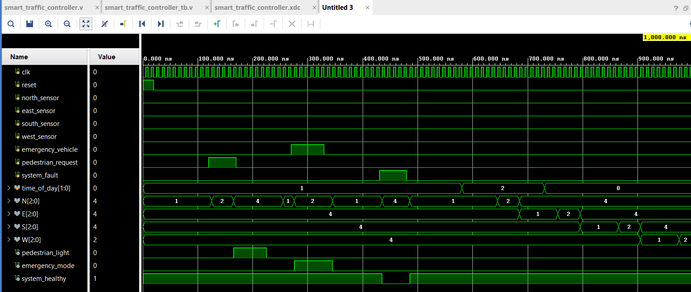

---

# Synthesis Results

RTL schematic generated by Vivado.

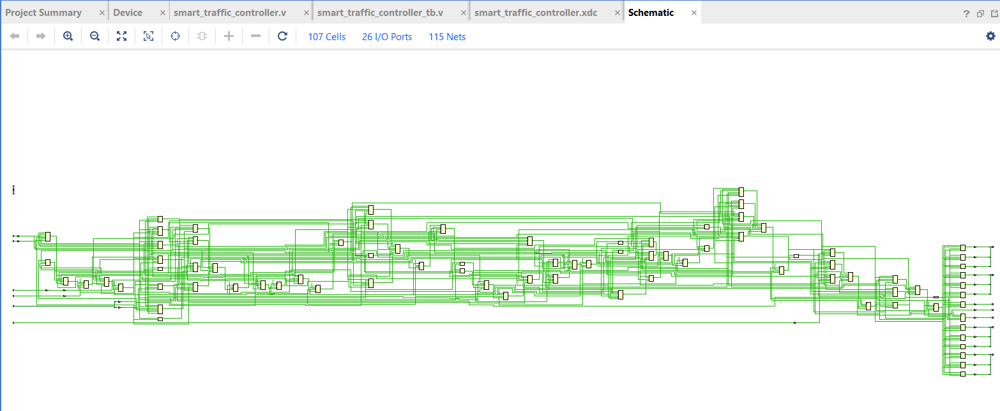

Device utilization and implementation view.

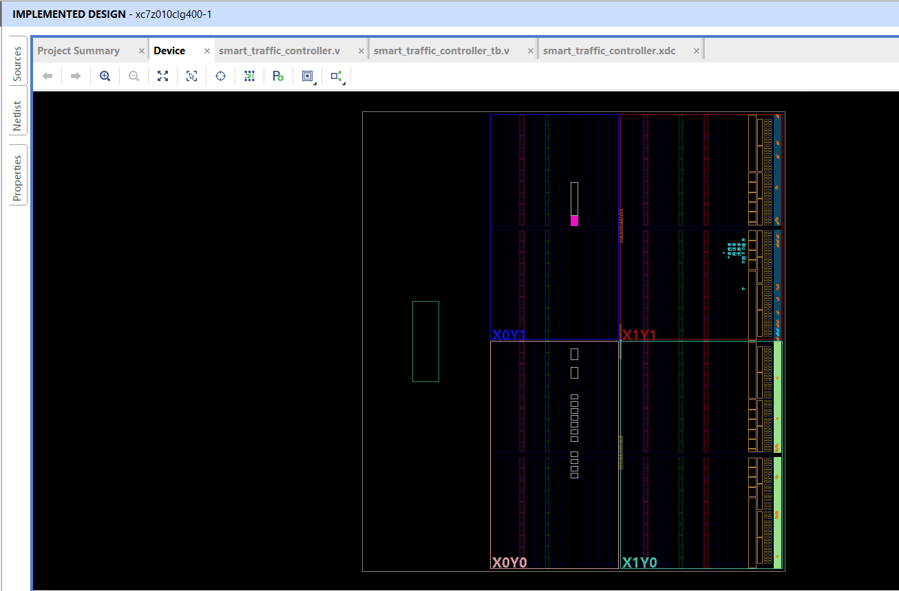

---

# Results and Analysis Reports

### Design Runs

* synth_design Complete
* route_design Complete

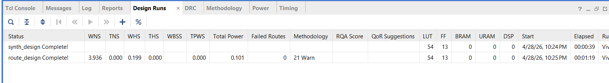

### Resource Utilization

* LUT : 54
* FF : 13
* BRAM : 0
* DSP : 0

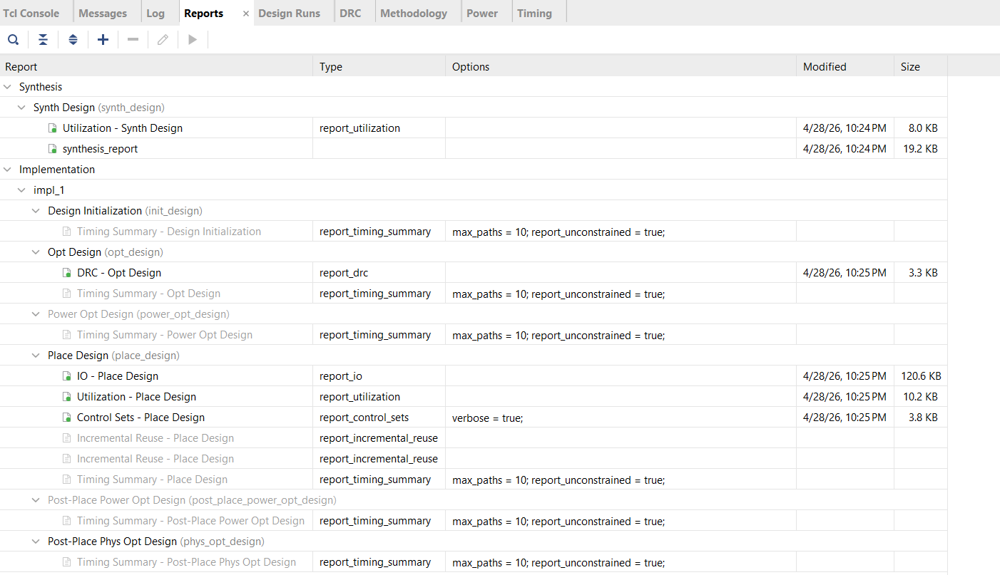

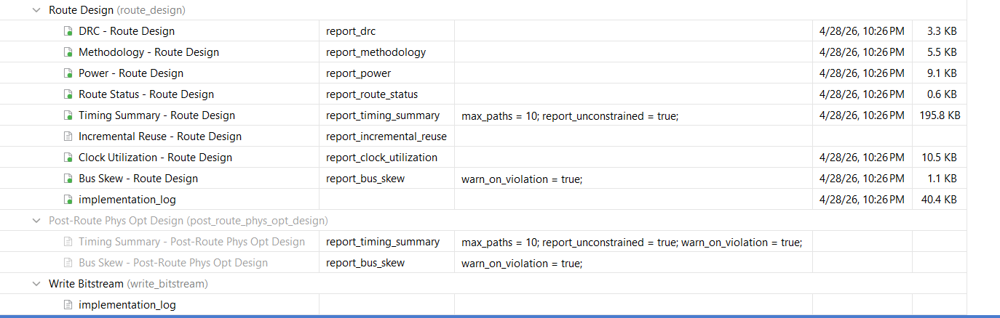

### Timing Analysis

* All user specified timing constraints are met
* Total Negative Slack (TNS) = 0
* Total Hold Slack (THS) = 0
* No failing endpoints

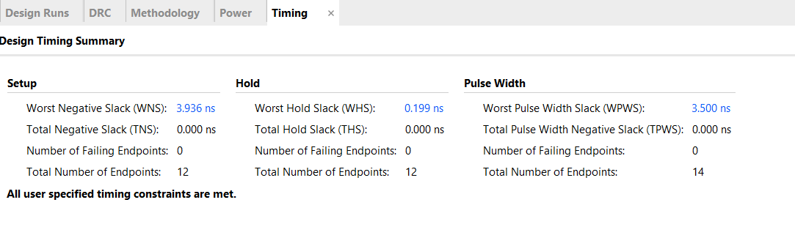

---

# Power Analysis

Total On-Chip Power

```text
0.101 W
```

Dynamic Power

```text
0.008 W
```

Device Static Power

```text
0.093 W
```

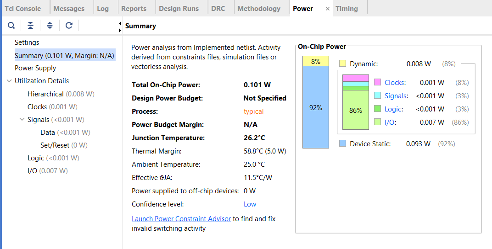

---

# Tools Used

* Verilog HDL
* Xilinx Vivado
* FPGA synthesis tools
* FSM-based Digital Design

---

# Applications

This controller is widely used in:

* Smart City Traffic Management
* Intelligent Transportation Systems
* Emergency Vehicle Routing
* Pedestrian Safety Systems
* Urban Signal Automation
* FPGA-based Embedded Traffic Solutions

---

# What I Learned

Through this project, I learned:

* FSM design for real-time traffic management
* Multi-state traffic signal sequencing
* Priority handling for emergency vehicles
* Pedestrian crossing safety implementation
* Adaptive timing based on day, peak, and night modes
* Safe state design during system faults
* Simulation using testbench and waveform analysis
* Vivado synthesis and implementation flow
* Timing analysis and slack verification
* Power analysis and FPGA resource utilization

This project improved my practical understanding of **Verilog HDL**, **FSM-based Control Systems**, and **FPGA-based Smart Traffic Automation**.

---

# Author

**Gayathri Wagdevi**
ECE Student
KL University
